# Unity Post Effect

<ul>
	<ol>Original 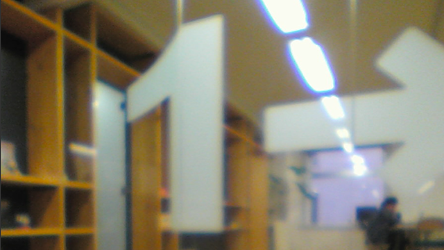</ol>
	<ol>Bleach 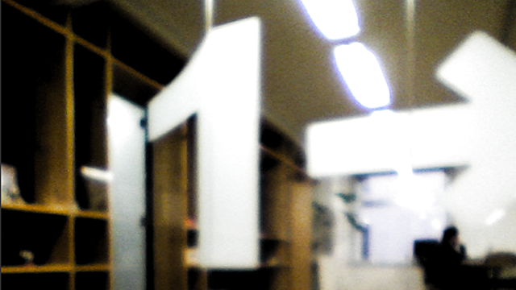</ol>
	<ol>Bloom 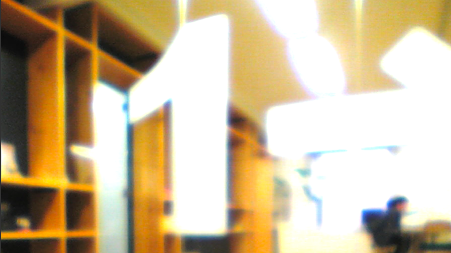</ol>
	<ol>Circle Mosaic 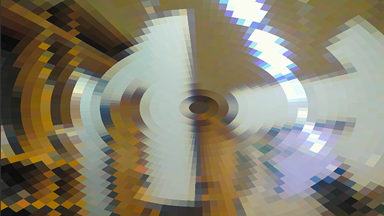</ol>
	<ol>Emboss 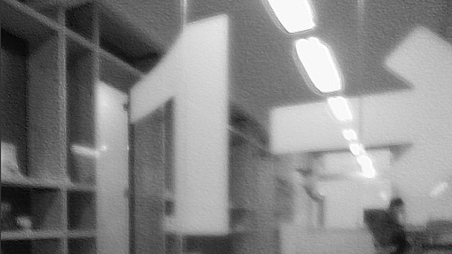</ol>
	<ol>HSU Saturation </ol>
	<ol>Lines 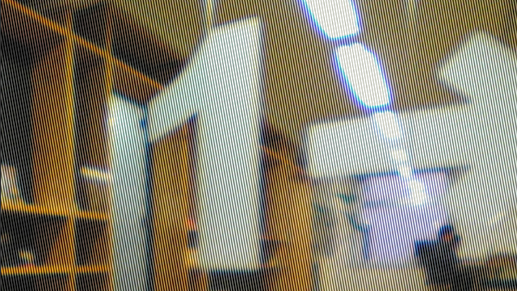</ol>
	<ol>Mirror 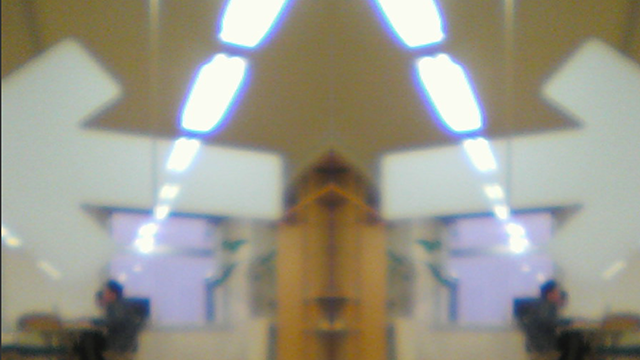</ol>
	<ol>Mosaic 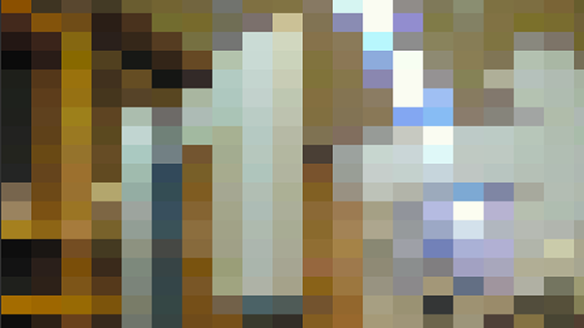</ol>
	<ol>Posterize 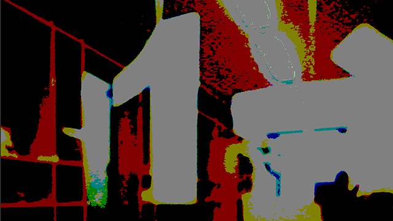</ol>
	<ol>RGB Shift 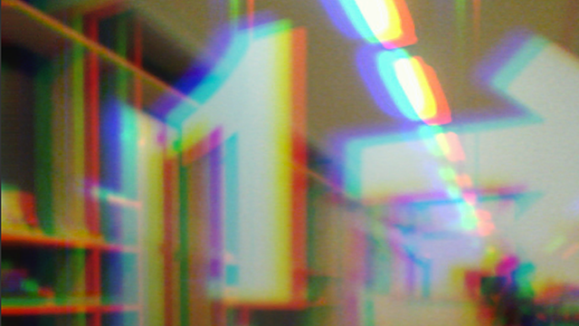</ol>
	<ol>Ripple 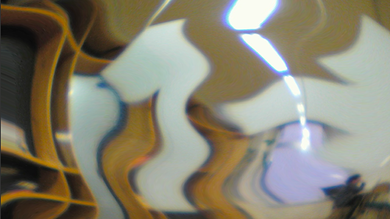</ol>
	<ol>Slice 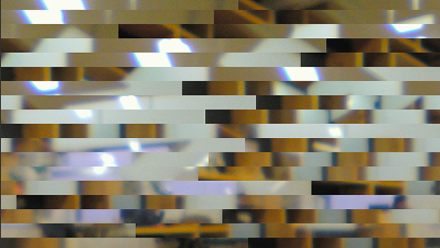</ol>
	<ol>Tile Shift 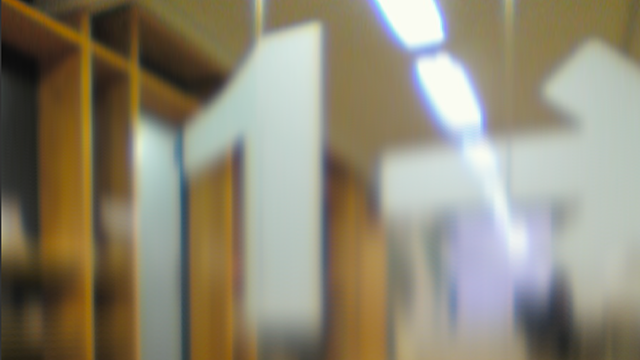</ol>
	<ol>TV Noise 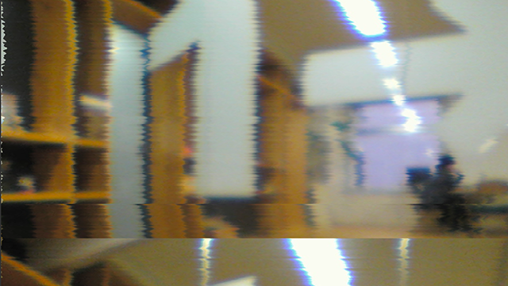</ol>
	<ol>VHS Video 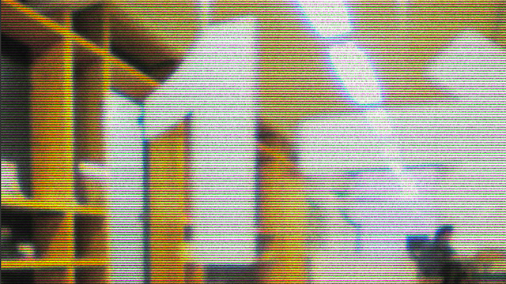</ol>
	<ol>Vignette 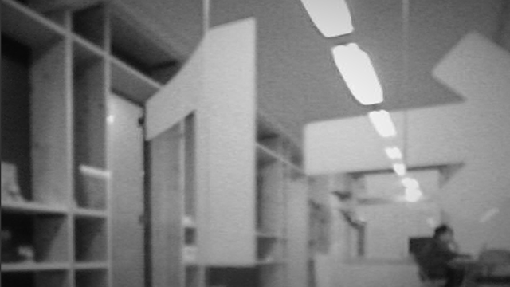</ol>
</ul>
